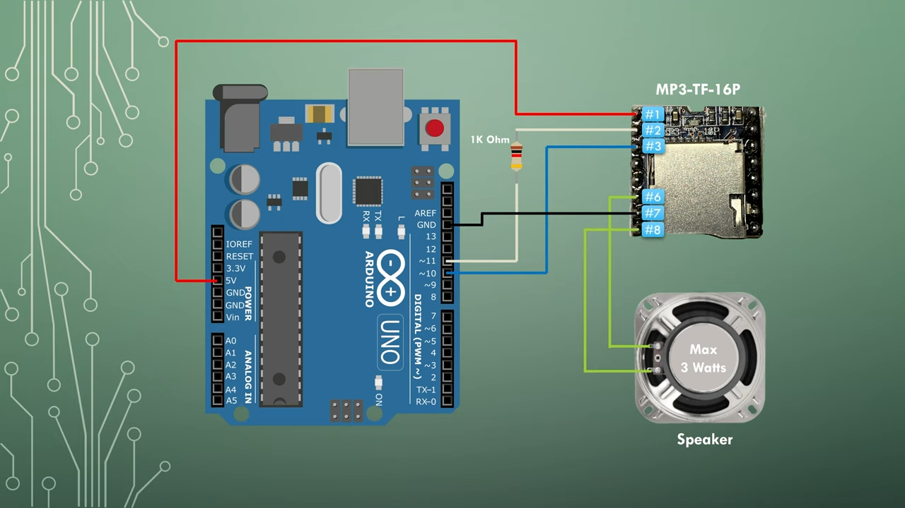
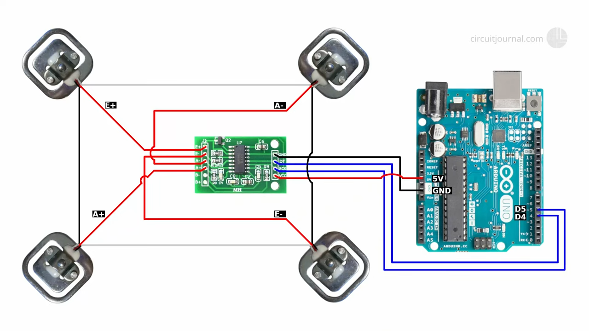

# WAKY WAKY

### Gemaakt door: Nour

---

## Over het project
**WAKY WAKY** is een slim wekker-systeem dat ervoor zorgt dat je niet makkelijk terug in slaap valt. Het systeem gebruikt gewichtssensoren om te detecteren of je echt uit bed bent, en een MP3-speler om een wekgeluid af te spelen. Het idee is simpel: ga je terug in bed liggen, dan gaat de wekker opnieuw af!

---

## Repositorystructuur

De repository van dit project heet **`WAKEY-WAKEY`** en bevat de volgende mappen:

- **`wekker onderdelen`**  
  Deze map bevat een verzameling submappen, één per hardwareonderdeel (zoals knop, gewichtssensor, mp3-speler). In elke map staat een `.ino`-bestand met **basis/testcode** om het onderdeel los te testen en werkend te krijgen.  
  Dit is handig bij fouten tijdens het samenstellen van het totale systeem. Sommige mapjes bevatten ook bijhorende libraries.

- **`WEKKER_SAMENSTELLING`**  
  Bevat de **hoofdcode van het project**: `WEKKER_SAMENSTELLING.ino`.  
  Dit is het bestand dat je moet uploaden naar de Arduino om het wekker-systeem te laten werken.  
  In deze map zitten ook externe libraries, een klasgenoot-review (`REVIEW_WASSIM.md`) en de opdrachtbeschrijving (`ASSESSMENT.md`).

---

## Functionaliteiten
- **MP3-speler**: Speelt een liedje af vanaf een SD-kaart om je wakker te maken.  
- **Gewichtssensoren**: Detecteren of je uit bed bent gestapt of weer bent gaan liggen.  
- **Knop**: Hiermee kun je het alarm stoppen als je daadwerkelijk uit bed bent.  

---

## Organisatie van de code

De hoofdcode staat in het bestand **`WEKKER_SAMENSTELLING.ino`**.  
In dit bestand worden de onderdelen samengebracht tot één werkend systeem.  
De code bestaat uit functies voor:
- Initialiseren van onderdelen (gewichtssensor, knop, mp3-speler)
- Starten van twee timers (slaap- en herstarttimer)
- Afspelen van een alarm op basis van gewicht en knopstatus
- Het regelmatig bijwerken van variabelen zoals tijd, gewicht en status

De `loop()` zorgt ervoor dat deze functies continu worden gecontroleerd en uitgevoerd zolang de Arduino aan staat.

---

## Installatie en gebruik

### Benodigdheden:
- Een **Arduino Uno**
- Hardwarecomponenten:
  - **MP3-speler module**
  - **Gewichtssensoren**
  - **Drukknop**

### Stappen:
1. Sluit alle onderdelen aan op de Arduino Uno. De juiste pinnen vind je bovenaan in de `WEKKER_SAMENSTELLING`-code. Verderop in dit document zie je schema's per onderdeel. Onderaan staan video’s die de aansluitingen stap voor stap uitleggen.
2. Installeer de benodigde bibliotheken:
   - **Extern**: 
     - [MP3-TF-16P](https://dev.azure.com/overlording/The%20Last%20Outpost%20Workshop/_git/MP3-TF-16P)

   - **Via Arduino IDE**:
     - `DFRobotDFPlayerMini` (voor de MP3-speler)
     - `HX711_ADC` (voor de gewichtssensor)
3. Open het bestand **`WEKKER_SAMENSTELLING.ino`** in de Arduino IDE en upload het naar de Arduino.
4. Bekijk de afbeeldingen in de volgende sectie om je bedrading te controleren.

---

## Hardware-aansluitingen

Hieronder zie je hoe je elk onderdeel moet aansluiten op de Arduino Uno:

1. **MP3-speler module**  
   

2. **Gewichtssensoren**  
   

3. **Drukknop**  
   

---

## Extra uitleg en referenties

Leer meer over de onderdelen via deze handige YouTube-video's:  

- **Gewichtssensoren**  
  

- **MP3 Player**  
  

- **Knop**  
  

---

## Demonstratievideo

Bekijk hier hoe het hele systeem werkt in de praktijk:

---

## Toekomstige verbeteringen

- Een display toevoegen om de tijd te tonen.  
- De mogelijkheid om meerdere wekgeluiden te kiezen.  
- Een mobiele app bouwen om de wekker te bedienen.

---

## Dankwoord

Dank aan mijn begeleiders, vooral Mo, voor de begeleiding. Ook dank aan de makers van de YouTube-video’s die ik heb gebruikt – zij hebben het veel makkelijker gemaakt.

---

## Bronvermelding

- **Gewichtssensoren**:  
  [YouTube-video](https://youtu.be/LIuf2egMioA?si=A7XPyC9-2faqjMKG),  
  [HX711_ADC GitHub](https://github.com/olkal/HX711_ADC),  
  [Schema’s](https://circuitjournal.com/50kg-load-cells-with-HX711)

- **MP3 Player**:  
  [YouTube-video](https://youtu.be/PBdqgHj_AkU?si=pbIv38PhXdfLJ4m9),  
  [Library GitHub](https://dev.azure.com/overlording/The%20Last%20Outpost%20Workshop/_git/MP3-TF-16P)

- **Knop**:  
  [YouTube-video](https://youtu.be/VPGRqML_v0w?si=hWb6luXIO06AUFNs)

---

**Veel succes met het bouwen van je eigen WAKY WAKY wekker!**
